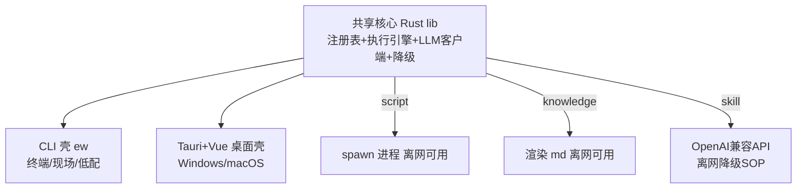

# Elwright 架构方案

> 版本：v0.1（规划稿）｜ 日期：2026-08-21 ｜ 状态：阶段 0（建仓 + 方案）

## 1. 背景与动机

### 1.1 痛点
积累的 skill（工作流能力）被锁死在 agent 运行时里。没有 LLM 或 agent 不可用，连本可独立运行的脚本都够不着。

两个真实场景：
- **场景 A（空窗期）**：AI coding 固定积分，超额需申请（≈1 天审批）。审批期间客户端在但 LLM 断供 → skill 全废。
- **场景 B（全离线）**：出差客户现场关门开发（无网无 agent），或现场实施人员无 agent / 无针对现场的 agent → skill 用不了。

### 1.2 使命（开源普惠）
让接触不到 AI、或没钱开通 LLM 的人，也能享受大模型红利，提高效率，把时间还给自己——多陪家人、提升自己、享受人生。

### 1.3 设计哲学（pi-mono 极简）
- **只放自己用到的东西**（参考 pi-mono 的 read/write/edit/bash 四个）。
- **LLM 是增强插件，不是地基**：工具自身独立存在，离网也能跑。
- **离网覆盖 70% 日常操作流**：操作类/机械类流程离网可用；思考类（评审/优化）离线降级为 SOP。

## 2. 产品定位

- **个人工作流工具箱**，双形态：**CLI + 桌面应用**，LLM-independent core。
- **名称**：`Elwright`
  - `El` = 超人 Kryptonian 姓氏后缀，意为星 / 光 / 家；
  - `wright` = 工匠 / maker；
  - 合意：「超人家的造工具的人」——普通人（无 AI）也能锻造自己的超能力。
- **命令**：CLI `ew`（或 `elwright`）。
- **Tagline**：普通人也能用上的大模型红利 · LLM 是增强不是地基。

## 3. 核心架构：一个核心，两个壳

- **共享核心（Rust lib）**：能力注册表加载、脚本执行引擎、LLM 客户端、离线降级逻辑——只写一遍，CLI 与桌面共用。
- **CLI 壳**：`ew ls` 列表 / `ew run <id>` 跑脚本型 / `ew view <id>` 看知识型 / `ew invoke <id>` 调技能型。现场/SSH/低配机首选，也是开源普惠主入口。
- **桌面壳**：Tauri 2 + Vue 3 + Vite，给要界面的用户。
- **跨平台**：Windows（优先）+ macOS；Linux 后续。



## 4. 能力模型（三类）

| 类型 | 离网可用 | 处理方式 |
|---|---|---|
| script | ✅ 直接跑 | 核心 spawn 进程 |
| knowledge | ⚠️ 当文档翻 | 核心渲染 md |
| skill | ❌ 离线降级 SOP | 核心调 LLM；不可达时展示 SOP 文档 |

注册表条目示例：

```json
{
  "id": "doc-keyword-search",
  "name": "文档关键字搜索",
  "type": "script",
  "category": "知识库",
  "entry": "resources/tools/doc-keyword-search/search_doc.py",
  "offline": true
}
```

```json
{
  "id": "tech-grill",
  "type": "skill",
  "name": "八层拷问",
  "prompt": "八层提问模板...",
  "offline": false,
  "degradeDoc": "resources/docs/tech-grill-sop.md"
}
```

**离线降级规则**：技能型被调用时检测 LLM 可达性；不可达（场景 A 空窗 / 场景 B 离线）则展示 `degradeDoc`，不报错。

## 5. LLM 接入（OpenAI Compatible）

- 设置项：`base_url` + `api_key` + `model`，用户自配。
- **默认指向本地模型**（如 `http://localhost:11434/v1`），场景 A 空窗期可切本地模型复活技能型。
- 场景 B 无模型 → 技能型降级 SOP。
- 兼容任意 OpenAI 兼容端点（云端 / 本地 Ollama / llama.cpp 等）。

## 6. 种子能力清单（初版）

> 原则：只列常用做 seed；**具体 skill 文件暂不改**（见第 8 节）。

**脚本型（离网 ✅）**
文档关键字搜索、Excel转md、Word转md、产品包需求→功能清单、修改说明→功能清单、能力标签自动生成、jar反编译、一键部署、知识库查孤儿/树/校验(3个)、桌面快捷方式、VSCode扩展管理。

**知识型（离网可看 ⚠️，挑高频）**
WDS定制知识+踩坑、ModbusTCP学习笔记、JVM崩溃日志排查、HTTP接口鉴权方案对比、（其余 knowledge-doc 笔记后续批量导入）。

**技能型（需 LLM，离线降级）**
八层拷问、提示词优化、知识总结分享、工作总结、接口文档格式化（待确认脚本/技能）、需求选点。

**暂不入册（环境/个人类）**
`pi/`（获取LLM手段）、`login-wechat/`（隐私）、`process-analysis/`（未开发）、toolbox 根老住户。

## 7. 开源与分发

- **License**：MIT 或 Apache-2.0（见 LICENSE）。
- **默认零 LLM 可用**：脚本型 + 知识型 = 免费层（任何人装完即用）；技能型 = 接了模型才解锁的增强层。
- **小白友好 LLM 配置指引**：README 给本地 Ollama / 免费兼容端点填法。
- **分发**：Tauri 打 `msi`(Win) / `dmg`(macOS)；脚本作为 `resources/` 打包进 app，自带不依赖外部路径。
- **README 面向非技术用户**，降低门槛。

## 8. 与现有资产的关系

- `toolbox/` 下现有脚本（doc-keyword-search 等）→ 变为 script 型能力，打包进 resources。
- `D:\knowledge-doc` 笔记 → knowledge 型能力（viewer）。
- 旧的 `toolbox/kit/方案.md` → 保留为 v0（PowerShell）取消纪要，不删。
- `pi/`、`login-wechat/` 等 → 暂不入册。
- **本期不移动/改写任何现有 skill 文件**，仅将引用登记进 `capabilities.json`，待阶段 1 再决定脚本如何导入 resources。

## 9. 技术栈详解（已锁定选型）

> 2026-08-21 拍板：以下选型全部确认，阶段 1 起按此落地。

### 9.1 选型总览（技术 → 解决什么问题 → 为什么选它）

| 技术 | 解决什么问题 | 选型核心理由 | 备选（未选理由） |
|---|---|---|---|
| **Rust**（核心语言） | 一套代码同时喂 CLI 壳 + 桌面壳；跨平台、单二进制、体积小、离网启动快 | Tauri 后端就是 Rust → 核心与桌面**同一语言、零 FFI 胶水** | Go（接 Tauri 要 sidecar/FFI，多一层）；Node/Electron（体积大、违背 pi-mono 极简 & 离网 70%）；Python（桌面壳不如 Tauri 轻） |
| **Tauri 2**（桌面壳，阶段 3） | 要界面但不打包整个 Chromium | 系统 WebView，单二进制几 MB，天然复用 Rust 核心 | Electron（重）；Flutter（Dart，复用不了 Rust 核心）；原生 WinUI/SwiftUI（不跨平台） |
| **Vue 3 + Vite**（桌面 UI，阶段 3） | 桌面壳前端渲染（列表/详情/invoke） | 开发者最熟（AstrBot dashboard 即 Vue3+Vite，可复用范式）；轻量、Tauri 官方模板支持 | React（需重拾习惯）；Svelte（需从零学，Tauri 已足够小，省体积无意义） |
| **OpenAI Compatible HTTP**（LLM 客户端，阶段 2） | 技能型调 LLM，端点各异（云端/Ollama/llama.cpp） | 一套 `/v1/chat/completions` 适配所有兼容端点，用户自填 base_url+key+model，不绑厂商 | 仅绑单厂商 SDK（锁定风险） |
| **capabilities.json**（注册表） | 能力清单如何被核心加载 | 静态 JSON，人可读、进 git 版本可控，阶段 0 已建种子 | SQLite（过度工程）；TOML（JSON 已用，无换必要） |
| **spawn 子进程**（脚本执行） | script 型是现成 .py/.ps1，核心不能 import | `std::process::Command` 原样执行，抓 stdout/exit code，**离网直接跑** | 嵌入解释器（重、环境耦合） |
| **tokio + serde + clap**（Rust 生态） | 异步运行时 / JSON 解析 / CLI 参数 | Rust 事实标准，无争议 | — |

### 9.2 三项关键决策（已定）

1. **LLM 客户端：自写 `reqwest` thin client**（不引 `async-openai` crate）。理由：只用到 `chat/completions` 一个端点，自写可控、零额外结构耦合，符合 pi-mono 极简。后期若需流式/工具调用再评估。
2. **注册表：v1 纯静态 JSON**（不做目录自动扫描）。理由：种子清单已就绪，静态可读可版本化；自动发现留作后续增强，不提前加复杂度。
3. **桌面 UI：Vue 3 + Vite**。理由见 9.1；开发者流利度优先于框架特性。

### 9.3 目录结构（V1）

```
Elwright/
├── src-tauri/           # Rust 核心 + Tauri 壳
│   ├── src/
│   │   ├── core/        # registry.rs / executor.rs / llm.rs / degrade.rs
│   │   └── main.rs      # Tauri 入口
│   └── Cargo.toml
├── src/                 # Vue3 桌面界面（阶段3）
├── capabilities.json    # 能力注册表（种子清单）
├── resources/
│   ├── tools/           # 脚本型能力的 .py/.ps1（阶段1导入）
│   └── docs/            # 知识型/SOP 的 .md
├── README.md
└── LICENSE
```

CLI 壳复用同一 `src-tauri/src/core`，单独编译为 `ew` 二进制（`cargo build --bin ew`）。

## 10. 路线图

- **阶段 0**：建仓 + 本架构方案（本次）。
- **阶段 1**：Rust 核心（registry + executor + 脚本型跑通）+ CLI 壳，验证「离网 70%」。
- **阶段 2**：LLM 客户端 + 技能型 invoke + 降级。
- **阶段 3**：Tauri+Vue 桌面壳。
- **阶段 4**：跨平台打包（msi/dmg）+ 开源发布（MIT + README + 小白指引）。

## 11. 待确认 / 后续
- 具体 skill 文件本期不改（本期只规划，见第 8 节）。
- 名称把手核查：Elwright 在 GitHub / crates.io / npm 均无占用，域名未检索到（待发布时 registrar 确认）。✅
- `api-doc-formatter` 归类（脚本/技能）待定。
- Linux 支持列为后续。
- **技术栈三项决策已锁定**（2026-08-21，见 §9.2）：LLM 客户端自写 reqwest thin client；注册表 v1 纯静态 JSON；桌面 UI 用 Vue 3 + Vite。
