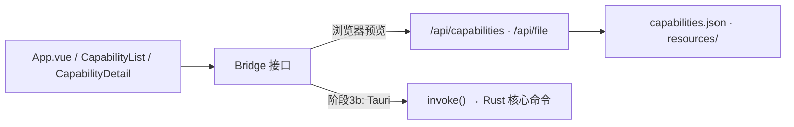

# 桌面壳前端 —— 架构

## 模块职责

- `lib/bridge.ts`：UI 与数据/执行层之间的唯一边界。`Bridge` 接口定义四个操作（listCapabilities / viewDoc / runScript / invokeSkill）；UI 组件只依赖接口。
- 浏览器适配器（已实现）：list 走 `/api/capabilities`；view/invoke 降级走 `/api/file?path=`；run 返回预览说明。
- Tauri 适配器（阶段 3b，挂接点在 `createBridge()`）：`window.__TAURI_INTERNALS__` 存在时改用 `@tauri-apps/api` 的 `invoke()` 调 Rust 侧命令。
- `vite.config.ts` 内 `elwrightDataApi` 插件：dev 服务器上的只读中间件——`/api/capabilities` 返回真实 `capabilities.json`；`/api/file?path=` 返回 `resources/` 下文件（路径 resolve 后强制前缀校验，防穿越）。

## 调用关系

## 关键设计

- **UI 不含数据访问代码**：全部经 Bridge，阶段 3b 换适配器时 UI 零改动。
- **预览即真实数据**：dev 中间件读仓库真实文件（非 mock），预览与桌面壳看到同一份注册表。
- Markdown 渲染用 `marked` 直出 `v-html`：内容全部来自本地 `resources/` 可信文件（与 CLI `ew view` 同源），不引入 sanitize 依赖。

## 系统边界

- 构建：Vite 8 + Vue 3 + TypeScript（仅 esbuild 转译，无 vue-tsc 类型门禁）。
- `src/` 是自包含 Vite 项目（package.json 在 `src/` 内，非仓库根）——这是有意为之，保持架构方案的目录规划。
