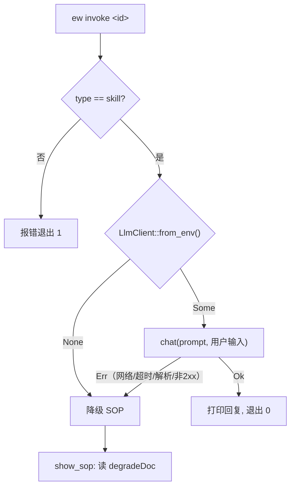

# 技能型 invoke —— 架构

## 模块职责

- `LlmClient`（`src-tauri/src/core/llm.rs`）：读环境变量构造配置；`chat(system, user)` 发起同步 HTTP 调用并解析响应。纯核心逻辑，不含 CLI I/O。
- `degrade::show_sop`（`src-tauri/src/core/degrade.rs`）：读 `degradeDoc` 文件内容为降级文案。
- `Cmd::Invoke`（`src-tauri/src/bin/ew.rs`）：类型校验 → 有配置则调 `chat` → 任一步失败走 `show_sop`。

## 调用关系

## 关键失败路径

- 连接失败 / 超时：reqwest 返回 Err → CLI 打印失败原因到 stderr → 降级 SOP。60 秒超时防止端点无响应时挂死。
- 端点返回错误：非 2xx 状态码或无法解析为 `{choices:[{message:{content}}]}` 的 JSON 均视为失败 → 降级。错误响应体截断至 500 字符展示。

## 系统边界

- HTTP：用户自配的 OpenAI 兼容端点（云端 / Ollama / llama.cpp 等）。
- 文件系统：项目根下 `degradeDoc` 指向的 SOP 文档。
