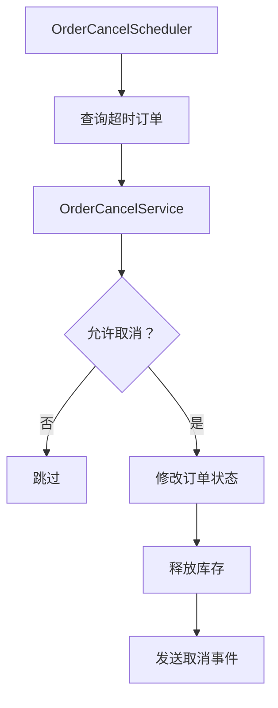

# 代码 Agent 开发与维护方案 —— 示例集

> **声明**：本文件中的目录树、文档成品、图表和提示词**只是示例**，用于展示"长什么样"，不是规则本身。
> 一切规则以 [AI_CODE_AGENT_MAINTENANCE.md](./AI_CODE_AGENT_MAINTENANCE.md) 为准。
> **方案修改时，必须同步检查并更新本文档。**

## 1. 整体目录树示例（对应方案 §4）

以下以"订单自动取消"为例：

```text
project/
├── AGENTS.md
├── docs/
│   ├── README.md
│   ├── features/
│   │   └── order-auto-cancel/
│   │       ├── README.md
│   │       ├── behavior.md
│   │       ├── architecture.md
│   │       ├── changelog.md
│   │       └── decisions/
│   │           └── ADR-001-use-scheduled-scanning.md
│   │
│   └── work/
│       └── active/
│           ├── feature-2026-07-add-auto-cancel/
│           ├── bugfix-2026-07-paid-order-cancellation/
│           ├── enhancement-2026-08-configurable-timeout/
│           └── refactor-2026-09-rebuild-cancel-engine/
│
│       └── archive/
│           ├── feature-2026-07-add-auto-cancel/
│           ├── bugfix-2026-07-paid-order-cancellation/
│           ├── enhancement-2026-08-configurable-timeout/
│           └── refactor-2026-09-rebuild-cancel-engine/
│
└── src/
    └── order/
        └── cancellation/
            ├── README.md
            ├── OrderCancelScheduler.ts
            ├── OrderCancelService.ts
            ├── OrderCancelPolicy.ts
            └── __tests__/
```

## 2. Feature 文档成品示例（对应方案 §5）

### 2.1 `README.md`

```markdown
# 订单自动取消

## 功能简介

自动取消超过支付时限仍未支付的订单。

## 当前状态

已上线，使用定时扫描实现。

## 代码入口

- `OrderCancelScheduler`
- `OrderCancelService`
- `OrderCancelPolicy`

## 相关文档

- [业务行为](./behavior.md)
- [架构说明](./architecture.md)
- [变更记录](./changelog.md)
- [设计决策](./decisions/ADR-001-use-scheduled-scanning.md)

## 相关测试

- `OrderCancelServiceTest`
- `OrderCancelSchedulerTest`
```

### 2.2 `behavior.md`

```markdown
# 订单自动取消 —— 业务行为

## 触发条件

- 订单状态为 `PENDING_PAYMENT`。
- 超过支付时限（默认 30 分钟，商户可配置）。

## 状态变化

`PENDING_PAYMENT` → `CANCELLED`。

## 成功和失败结果

- 成功：订单置为 `CANCELLED`，释放库存，发送 `OrderCancelled` 事件。
- 失败：订单保持 `PENDING_PAYMENT`，记录失败日志，下次扫描重试。

## 不允许的情况

- 已支付订单不取消。
- 取货中的订单不取消。

## 幂等、并发和重试

- 重复执行不能重复产生业务影响。
- 同一订单并发扫描时只有一个能生效。

## 对其他系统的影响

- 发送订单取消事件后，履约系统开始清点。
```

### 2.3 `architecture.md`

```markdown
# 订单自动取消 —— 架构

## 模块职责

- `OrderCancelScheduler`：定时扫描超时订单。
- `OrderCancelService`：执行取消流程。
- `OrderCancelPolicy`：判断订单是否允许取消。

## 调用关系



## 事务、重试、幂等和并发

- 取消流程在一个事务内完成。
- 取消事件发送失败时重试 3 次。
- 状态更新使用乐观锁，避免并发重复取消。

## 系统边界

- 数据库：订单表。
- 消息队列：`order.events`。
- 外部服务：库存服务。

## 关键失败路径

- 库存释放失败 → 事务回滚，订单保持 `PENDING_PAYMENT`。
```

> 复杂功能可增加时序图、状态图或系统边界图（见方案 §5.3）。

### 2.4 `changelog.md`

```markdown
## 2026-07-24

首次增加订单自动取消。

## 2026-07-28

修复已支付订单被错误取消的问题。

## 2026-08-15

支持商户配置不同的支付超时时间。
```

### 2.5 `decisions/ADR-001-use-scheduled-scanning.md`

```markdown
# ADR-001: 使用定时扫描而非延迟消息实现订单取消

## 状态

已接受。

## 背景

需要自动取消超过支付时限的订单。

## 决策

使用定时扫描（每 30 秒一次）查询超时订单并取消。

## 后果

- 优点：实现简单，不引入额外基础设施。
- 缺点：取消存在最多 30 秒延迟；扫描压力随订单量增长。
- 缓解：超时时间可由商户配置；后续订单量大时可评估引入延迟消息。

## 备选方案

- 延迟消息队列：延迟更精准，但需要引入新中间件。
```

## 3. 任务目录成品示例（对应方案 §6）

### 3.1 第一次新增功能 `feature-*`

```text
active/feature-2026-07-add-auto-cancel/
├── plan.md
├── checklist.md
├── verification.md
└── rollout.md
```

`plan.md`：

```markdown
# 新增订单自动取消

## 目标

超过 30 分钟未支付的订单自动取消。

## 实现步骤

1. 增加取消策略。
2. 增加定时扫描任务。
3. 接入库存释放。
4. 发布订单取消事件。
5. 增加单元测试和集成测试。

## 非目标

- 本次不支持商户自定义超时时间。
- 本次不改造订单状态机。

## 风险

- 扫描与支付成功并发时可能误取消 → 用乐观锁保护。

## 验证方式

- 单元测试：取消策略、扫描任务。
- 集成测试：模拟超时订单与正常订单。
```

`checklist.md`：

```markdown
# 检查清单

- [x] 增加取消策略
- [ ] 增加定时扫描任务
- [ ] 接入库存释放
```

`verification.md`：记录测试、静态检查和最终结论（如"全部通过，可上线"）。

`rollout.md`：记录上线顺序、监控指标和回滚方式；风险低时可省略。

### 3.2 Bug 修复 `bugfix-*`

```text
active/bugfix-2026-07-paid-order-cancellation/
├── change-note.md
└── verification.md
```

`change-note.md`：

```markdown
# 已支付订单被错误取消

## 问题

部分已支付订单在支付成功后仍被取消。

## 原因

扫描与支付回调并发，扫描读到旧状态后取消了订单。

## 修改范围

- `OrderCancelService`：状态更新前校验当前状态。
- `OrderCancelPolicy`：增加已支付状态排除。

## 风险与影响

- 已取消订单不涉及，影响面小。
```

### 3.3 中等修改 `enhancement-*`

```text
active/enhancement-2026-08-configurable-timeout/
├── plan.md
├── checklist.md
├── behavior-change.md
├── verification.md
└── rollout.md
```

`behavior-change.md`：

```markdown
# 行为变更：商户可配置支付超时时间

## 修改前

所有订单统一 30 分钟超时。

## 修改后

超时时间按商户配置读取，默认 30 分钟。

## 兼容策略

- 未配置商户使用默认值。
- 非法配置回退默认值。

## 边界情况

- 超时时间 0 表示不自动取消。
```

### 3.4 大修改 / 重构 `refactor-*`

```text
active/refactor-2026-09-rebuild-cancel-engine/
├── plan.md
├── design.md
├── architecture-before.md
├── architecture-after.md
├── migration.md
├── verification.md
└── rollout.md
```

- `design.md`：延迟消息方案设计、与定时扫描的取舍对比。
- `architecture-before.md`：改造前定时扫描结构。
- `architecture-after.md`：改造后延迟消息结构。
- `migration.md`：存量订单处理、双写与回滚。
- `verification.md`：功能、性能、故障恢复、兼容验证。
- `rollout.md`：灰度、监控、告警和回滚。

## 4. 归档后的目录树示例（对应方案 §7）

```text
archive/
├── feature-2026-07-add-auto-cancel/
│   ├── plan.md
│   ├── checklist.md
│   ├── verification.md
│   └── rollout.md
├── bugfix-2026-07-paid-order-cancellation/
│   ├── change-note.md
│   └── verification.md
├── enhancement-2026-08-configurable-timeout/
│   ├── plan.md
│   ├── checklist.md
│   ├── behavior-change.md
│   ├── verification.md
│   └── rollout.md
└── refactor-2026-09-rebuild-cancel-engine/
    ├── plan.md
    ├── design.md
    ├── architecture-before.md
    ├── architecture-after.md
    ├── migration.md
    ├── verification.md
    └── rollout.md
```

## 5. AGENTS.md 全文示例（对应方案 §9）

```markdown
# Coding Agent Rules

## 修改前

1. 阅读相关 Feature 的 README、behavior、architecture 和测试。
2. 总结当前行为，不要假设旧 Plan 仍然代表当前代码。
3. 判断任务类型：feature、bugfix、enhancement、refactor 或 migration。
4. 列出影响文件、风险、测试和需要更新的文档。

## 修改时

1. 小 Bug 使用 bugfix 目录和 change-note，不创建冗长 Plan。
2. 业务行为变化创建新的 enhancement 任务。
3. 架构或跨模块改造创建新的 refactor 任务。
4. 不把新需求追加到已完成的旧 Plan。
5. 行为变化必须同步更新测试和 Feature 文档。

## 修改后

1. 报告修改了什么以及为什么修改。
2. 报告测试、静态检查和验证结果。
3. 更新 behavior、architecture、changelog 或 ADR（按需）。
4. 任务完成后将目录从 active 移到 archive。
```

## 6. 给 Agent 的提示词模板示例（对应方案 §9）

```text
请先阅读相关 Feature 文档、当前实现和测试。
先判断这是 feature、bugfix、enhancement 还是 refactor。
先输出当前行为、目标行为、影响范围、风险、测试和文档更新计划，暂时不要改代码。
确认后再实施修改。
修改完成后报告变更文件、测试结果、验证结果和文档变化。
```
